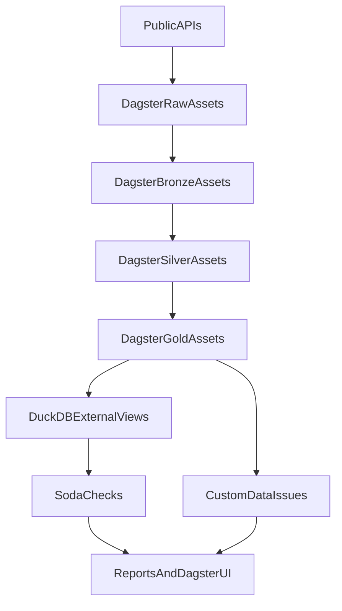

# Architecture (Step 4)

Positioning:
`MinIO/S3-compatible lake + partitioned Parquet + Polars-first processing + DuckDB for ad hoc analytical queries`.

## Components
- **MinIO**: local S3-compatible object store (Docker Compose).
- **Lake helpers**: S3 client, bucket creation, and read/write helpers.
- **Partitioning**: `{layer}/{dataset}/date=YYYY-MM-DD/...` where layer is one of `raw|bronze|silver|gold`.
- **Dagster** (Step 3.5): partitioned asset graph, schedules, backfills/replays, run monitoring, and materialization metadata.
- **DuckDB quality DB** (Step 3.5): external views over Parquet via `read_parquet(...)` for checks and ad hoc validation.
- **Soda Core** (Step 3.5): YAML-based data-quality checks executed against DuckDB.
- **Custom issue detector** (Step 3.5): domain-specific pipeline issues surfaced as structured `info|warning|high|critical` issues.
- **Live collectors** (Step 3): HTTP/`gdeltdoc` clients that hit Polymarket Gamma, Binance USD-M futures, and GDELT TimelineVol, and write raw JSONL with the **same shape as Step 2 sample files**.
- **Feature engineering** (Step 4): Polars transforms in `src/crypto_belief_pipeline/features/` for market tags, belief shocks, narrative acceleration, price reaction, forward labels, and underreaction scoring.
- **CLI**: operational + ingest commands (primitives) plus a one-shot orchestration wrapper:
  - primitives: `run-sample`, `fetch-live`, `run-live`, `build-gold`, `run-soda-checks`, `detect-data-issues`
  - wrapper: `pipeline run` (live or sample, optional gold/DQ/issues stages)

## Data flow

```
live APIs ──▶ raw JSONL ──▶ bronze Parquet ──▶ silver Parquet ──▶ features ──▶ labels ──▶ gold Parquet
sample JSONL ─┘
```

Step 3.5 adds a monitoring/quality layer:

```
Parquet lake ──▶ DuckDB external views (read_parquet) ──▶ Soda checks ──▶ reports + Dagster UI
                                     └──────────────▶ custom data issue detector ──▶ reports
```

The Step 2 sample files and the Step 3 live collectors emit the same raw schemas, so the same normalizers (`normalize_markets`, `normalize_price_snapshots`, `normalize_klines`, `normalize_timeline`, `to_belief_price_snapshots`, `to_crypto_candles_1m`, `to_narrative_counts`) handle both.

## Data lifecycle
1. Raw collectors (or sample inputs) write immutable JSONL into `raw/...`.
2. Normalization builds typed, source-shaped Parquet into `bronze/...`.
3. Normalization builds research-ready tables into `silver/...`.
4. Research outputs (features/labels/event studies) land in `gold/...` (later step).

## Lake layout
All datasets are partitioned by date:
`{layer}/{dataset}/date=YYYY-MM-DD/...`

Layers:
- `raw`: immutable source-shaped JSONL, minimal assumptions
- `bronze`: typed but still source-shaped Parquet (adds `ingested_at`, keeps `raw_json`)
- `silver`: normalized research-ready Parquet (cross-source consistency)
- `gold`: future outputs (features, labels, event study tables, reports)

## Step 2 sample pipeline keys
Raw:
- `raw/provider=polymarket/date=YYYY-MM-DD/sample_markets.jsonl`
- `raw/provider=polymarket/date=YYYY-MM-DD/sample_prices.jsonl`
- `raw/provider=binance/date=YYYY-MM-DD/sample_klines.jsonl`
- `raw/provider=gdelt/date=YYYY-MM-DD/sample_timeline.jsonl`

Bronze:
- `bronze/provider=polymarket/date=YYYY-MM-DD/markets.parquet`
- `bronze/provider=polymarket/date=YYYY-MM-DD/prices.parquet`
- `bronze/provider=binance/date=YYYY-MM-DD/klines.parquet`
- `bronze/provider=gdelt/date=YYYY-MM-DD/timeline.parquet`

Silver:
- `silver/belief_price_snapshots/date=YYYY-MM-DD/data.parquet`
- `silver/crypto_candles_1m/date=YYYY-MM-DD/data.parquet`
- `silver/narrative_counts/date=YYYY-MM-DD/data.parquet`

## Step 3 live keys
Raw (same schemas as the sample raw JSONL above):
- `raw/provider=polymarket/date=YYYY-MM-DD/live_markets.jsonl`
- `raw/provider=polymarket/date=YYYY-MM-DD/live_prices.jsonl`
- `raw/provider=binance/date=YYYY-MM-DD/live_klines.jsonl`
- `raw/provider=gdelt/date=YYYY-MM-DD/live_timeline.jsonl`

Bronze and silver outputs use the same keys as Step 2 (one date partition per run).

## Live collectors
- **Polymarket Gamma** (`https://gamma-api.polymarket.com/markets`): discovers markets and extracts current outcome prices defensively (handles `outcomes`/`outcomePrices` as native lists or JSON strings, and the `tokens` shape). Markets are filtered using `config/markets_keywords.yaml` against `question`, `slug`, `category`, tag labels, and `description`.
- **Binance USD-M** (`https://fapi.binance.com/fapi/v1/klines`): pulls the most recent 1-minute klines for `BTCUSDT`, `ETHUSDT`, `SOLUSDT` and converts the array shape to the Step 2 raw kline schema.
- **GDELT** (`gdeltdoc.GdeltDoc`): pulls TimelineVol series for each narrative in `config/narratives.yaml`. Defaults to the previous full UTC day to avoid partial-day weirdness.

## Reuse: shared raw → silver transform
`transform/run_raw_to_silver.py` reads any available raw JSONL keys from S3 (Polymarket/Binance/GDELT) and writes bronze + silver using the same normalizers as the sample pipeline. The live `run-live` command uses this to prove the contract without requiring every source to be present.

## Step 3.5 Dagster asset graph (coarse view)



## Step 4 silver → gold flow

`features/build_gold.py::build_gold_tables` reads three silver tables, joins them, applies labels and scoring, and writes:

```
silver/belief_price_snapshots ──▶ features/belief.py ──┐
silver/narrative_counts       ──▶ features/narrative.py├──▶ join ──▶ features/labels.py ──▶ features/scoring.py ──▶ gold
silver/crypto_candles_1m      ──▶ features/prices.py  ──┘
```

Step 4 gold keys:
- `gold/training_examples/date=YYYY-MM-DD/data.parquet` (full joined frame, includes `is_candidate_event`)
- `gold/alpha_events/date=YYYY-MM-DD/data.parquet` (rows where `is_candidate_event == true`)

Joins:
- Belief features `LEFT JOIN` narrative features on `(event_time, narrative)`
- Result `LEFT JOIN` price features on `(event_time, asset)`

Manual market interpretation lives in `data/sample/market_tags.csv`. Markets without a tag row are excluded from gold features (see `features/market_tags.py`).