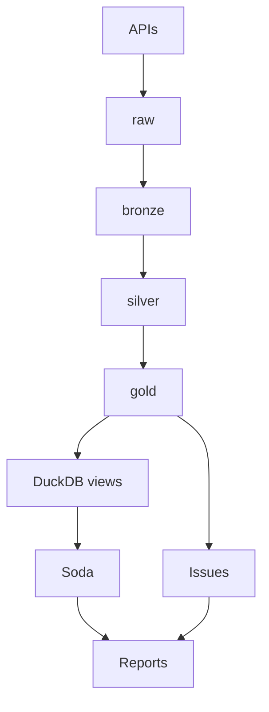

# Architecture

S3-compatible lake (MinIO locally) + **partitioned Parquet** + **Polars** transforms + **Dagster** orchestration + **DuckDB** (external views) + **Soda** + custom **issue detector**.

## Flow

```
APIs or sample JSONL → raw JSONL → bronze Parquet → silver Parquet → gold Parquet
                                                              ↓
                                    DuckDB views → Soda + issues → reports
```

Live and sample share **raw JSONL shapes** → shared normalizers.

## Lake

`{layer}/{dataset}/date=YYYY-MM-DD/...` — `layer ∈ {raw, bronze, silver, gold}`.

| Layer | Content |
|-------|---------|
| raw | Immutable JSONL (+ `hour=` / `batch_id=` microbatches when live) |
| bronze | Typed, source-shaped Parquet (`raw_json`, `ingested_at`) |
| silver | Normalized research tables |
| gold | `training_examples`, `live_signals` |

**Sample keys (compact):**  
`raw/provider={polymarket,binance,gdelt}/date=…/sample_*.jsonl` → bronze `…/markets|prices|klines|timeline.parquet` → silver `belief_price_snapshots`, `crypto_candles_1m`, `narrative_counts` under `date=…/data.parquet`.

**Live raw (microbatch):** `raw/provider=…/date=…/hour=HH/batch_id=*.jsonl`; bronze/silver often compact to `date=…/data.parquet` or hourly `partition=…` for gold.

## Collectors (live)

- **Polymarket Gamma:** markets + prices; filters from `config/markets_keywords.yaml`; defensive parsing for outcomes/prices/tokens.
- **Binance USD-M:** klines in `[start,end)` windows.
- **GDELT:** TimelineVol via `gdeltdoc` + in-repo `httpx` (rate limits, retries).

## Gold build

`features/build_gold.py`: silver belief + narrative + candles → `features/{belief,narrative,prices,labels,scoring}.py` → Parquet. Joins: belief **left** narrative on `(event_time, narrative)`; **left** prices on `(event_time, asset)`. Tags: `data/sample/market_tags.csv` (markets without tags dropped).

Keys: `gold/{training_examples,live_signals}/date=…/data.parquet` (CLI); Dagster may use `partition=YYYY-MM-DD-HH-00/`.

## Dagster (coarse)



## Deferred

- Event-study report tables / long-form research markdown (not in repo).
- `full_stack__sample__manual_job` pulls live upstream assets; **offline:** `pipeline run --mode sample` or `make full-sample`.
